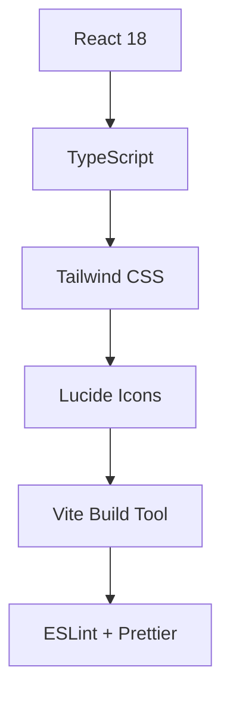

# 🧠✨ BrainSpark - Personal Idea Notebook

<div align="center">
  
  
  <h1 style="margin: 30px 0; font-size: 3em; background: linear-gradient(135deg, #667eea 0%, #764ba2 100%); -webkit-background-clip: text; -webkit-text-fill-color: transparent;">
    🚀 BrainSpark
  </h1>
  
  <p style="font-size: 1.3em; color: #666; margin-bottom: 30px;">
    <strong>Transform scattered thoughts into structured brilliance</strong><br>
    <em>The ultimate personal idea notebook for creative minds</em>
  </p>
  
  [](https://achrefrhouma.github.io/brainspark)
  [](https://github.com/AchrefRhm/BrainSpark---Personal-Idea-Notebook/stargazers)
  [](https://github.com/AchrefRhm/BrainSpark---Personal-Idea-Notebook/network)
  [](https://opensource.org/licenses/MIT)
  
  <br><br>
  
  [](https://reactjs.org/)
  [](https://www.typescriptlang.org/)
  [](https://tailwindcss.com/)
  [](https://vitejs.dev/)
  
  <br><br>
  
  <a href="#-features">Features</a> •
  <a href="#-demo">Demo</a> •
  <a href="#-installation">Installation</a> •
  <a href="#-usage">Usage</a> •
  <a href="#-contributing">Contributing</a> •
  <a href="#-license">License</a>
</div>

---

## 🌟 Why BrainSpark?

<table>
<tr>
<td width="50%">

### 🎯 **For Creative Professionals**
- **Writers & Authors** - Organize plot ideas, character development
- **Designers & Artists** - Capture visual concepts and inspiration
- **Entrepreneurs** - Develop business strategies and innovations
- **Researchers** - Structure complex ideas and findings

</td>
<td width="50%">

### 🔒 **Privacy-First Design**
- **100% Offline** - No internet required after initial load
- **Local Storage** - Your ideas never leave your device
- **No Tracking** - Zero analytics or data collection
- **Open Source** - Transparent and auditable code

</td>
</tr>
</table>

---

## ✨ Features

<div align="center">
  
</div>

### 🚀 **Core Functionality**

<table>
<tr>
<td width="33%" align="center">
  
  <h4>💡 Idea Management</h4>
  <p>Create, edit, and organize ideas with rich text formatting, categories, and tags</p>
</td>
<td width="33%" align="center">
  
  <h4>🔗 Smart Linking</h4>
  <p>Connect related ideas to build comprehensive knowledge networks and mind maps</p>
</td>
<td width="33%" align="center">
  
  <h4>🔍 Advanced Search</h4>
  <p>Find ideas instantly with powerful search across titles, content, tags, and categories</p>
</td>
</tr>
</table>

### 🎨 **Design Excellence**

- **🍎 Apple-Inspired Interface** - Clean, minimalist design with attention to detail
- **🌊 Smooth Animations** - Delightful micro-interactions and transitions
- **📱 Fully Responsive** - Perfect experience on desktop, tablet, and mobile
- **🎯 Intuitive UX** - Zero learning curve, start organizing ideas immediately
- **🌈 Color-Coded Categories** - Visual organization with customizable color schemes

### 📊 **Advanced Features**

- **📤 Multiple Export Formats** - Text, JSON, and Markdown with metadata options
- **🏷️ Smart Tagging System** - Flexible organization with multiple tags per idea
- **📅 Automatic Timestamps** - Track creation and modification dates
- **🔄 Real-time Sync** - Instant updates across all components
- **⚡ Lightning Fast** - Optimized performance with virtual scrolling

---

## 🎬 Demo & Screenshots

<div align="center">
  
### 🖥️ **Main Dashboard**


*Clean, organized view of all your ideas with powerful filtering and search capabilities*

### ✏️ **Idea Creation & Editing**


*Intuitive modal interface for creating and editing ideas with category selection, tagging, and linking*

### 🔗 **Idea Linking & Networks**


*Visual representation of connected ideas forming comprehensive knowledge networks*

### 📱 **Mobile Experience**
<div style="display: flex; justify-content: center; gap: 20px; margin: 20px 0;">
  
  
  
</div>

*Seamless mobile experience with touch-optimized interface*

</div>

---

## 🚀 Quick Start

### 📋 **Prerequisites**

```bash
Node.js >= 16.0.0
npm >= 8.0.0 or yarn >= 1.22.0
```

### ⚡ **Installation**

```bash
# Clone the repository
git clone https://github.com/AchrefRhm/BrainSpark---Personal-Idea-Notebook.git

# Navigate to project directory
cd BrainSpark---Personal-Idea-Notebook

# Install dependencies
npm install

# Start development server
npm run dev

# Open your browser to http://localhost:5173
```

### 🏗️ **Build for Production**

```bash
# Create optimized production build
npm run build

# Preview production build locally
npm run preview

# Deploy to your preferred hosting platform
npm run deploy
```

---

## 📖 Usage Guide

### 🎯 **Getting Started**

<table>
<tr>
<td width="50%">

#### 1️⃣ **Create Your First Idea**
- Click the **"New Idea"** button
- Add a compelling title and description
- Select a category and add tags
- Save and watch it appear in your dashboard

#### 2️⃣ **Organize with Categories**
- Use default categories or create custom ones
- Each category has a unique color
- Filter ideas by clicking category names
- Visual organization at a glance

</td>
<td width="50%">

#### 3️⃣ **Link Related Ideas**
- Edit any idea to see linking options
- Connect related concepts
- Build comprehensive idea networks
- Visualize relationships between thoughts

#### 4️⃣ **Search & Discover**
- Use the search bar for instant results
- Search across titles, content, and tags
- Combine search with category filters
- Find exactly what you're looking for

</td>
</tr>
</table>

### 🔧 **Advanced Features**

<details>
<summary><strong>🎨 Customization Options</strong></summary>

```typescript
// Add custom categories
const customCategory: Category = {
  id: crypto.randomUUID(),
  name: 'Research',
  color: '#EF4444',
  icon: 'BookOpen'
};

// Extend idea properties
interface ExtendedIdea extends Idea {
  priority: 'low' | 'medium' | 'high';
  status: 'draft' | 'developing' | 'complete';
  deadline?: Date;
}
```

</details>

<details>
<summary><strong>📤 Export Options</strong></summary>

- **Text Format** - Clean, readable text files
- **JSON Format** - Structured data with full metadata
- **Markdown Format** - Perfect for documentation and sharing
- **Selective Export** - Choose specific categories or date ranges
- **Metadata Control** - Include or exclude timestamps and links

</details>

<details>
<summary><strong>⌨️ Keyboard Shortcuts</strong></summary>

| Shortcut | Action |
|----------|--------|
| `Ctrl + N` | New Idea |
| `Ctrl + F` | Search |
| `Ctrl + E` | Export |
| `Esc` | Close Modal |
| `Enter` | Save Idea |

</details>

---

## 🏗️ Architecture & Tech Stack

<div align="center">
  
</div>

### 🛠️ **Frontend Stack**



### 📁 **Project Structure**

```
src/
├── 🎨 components/          # Reusable UI components
│   ├── Sidebar.tsx        # Navigation and search
│   ├── IdeaCard.tsx       # Individual idea display
│   ├── IdeaModal.tsx      # Idea creation/editing
│   ├── ExportModal.tsx    # Export functionality
│   └── EmptyState.tsx     # Empty state handling
├── 🔧 hooks/              # Custom React hooks
│   ├── useIdeas.ts        # Idea management logic
│   └── useLocalStorage.ts # Local storage utilities
├── 📝 types/              # TypeScript definitions
│   └── index.ts           # Core type definitions
├── 🛠️ utils/              # Utility functions
│   └── exportUtils.ts     # Export functionality
└── 📱 App.tsx             # Main application component
```

### 🔄 **State Management**

- **Custom Hooks** - Lightweight state management with React hooks
- **Local Storage** - Persistent data storage without external dependencies
- **Type Safety** - Full TypeScript coverage for robust development
- **Performance** - Optimized re-renders with React.memo and useMemo

---

## 🤝 Contributing

<div align="center">
  
</div>

We welcome contributions from developers of all skill levels! Here's how you can help make BrainSpark even better:

### 🌟 **Ways to Contribute**

<table>
<tr>
<td width="25%" align="center">
  <h4>🐛 Bug Reports</h4>
  <p>Found a bug? Help us squash it!</p>
  <a href="https://github.com/AchrefRhm/BrainSpark---Personal-Idea-Notebook/issues/new?template=bug_report.md">Report Bug</a>
</td>
<td width="25%" align="center">
  <h4>💡 Feature Requests</h4>
  <p>Have an idea? We'd love to hear it!</p>
  <a href="https://github.com/AchrefRhm/BrainSpark---Personal-Idea-Notebook/issues/new?template=feature_request.md">Request Feature</a>
</td>
<td width="25%" align="center">
  <h4>📝 Documentation</h4>
  <p>Help improve our guides and examples</p>
  <a href="https://github.com/AchrefRhm/BrainSpark---Personal-Idea-Notebook/wiki">Edit Wiki</a>
</td>
<td width="25%" align="center">
  <h4>🔧 Code</h4>
  <p>Submit pull requests and improvements</p>
  <a href="#-development-setup">Get Started</a>
</td>
</tr>
</table>

### 🚀 **Development Setup**

```bash
# Fork the repository on GitHub
# Clone your fork
git clone https://github.com/YOUR_USERNAME/BrainSpark---Personal-Idea-Notebook.git

# Create a feature branch
git checkout -b feature/amazing-feature

# Make your changes and commit
git commit -m "Add amazing feature"

# Push to your fork
git push origin feature/amazing-feature

# Open a Pull Request
```

### 📋 **Contribution Guidelines**

- **Code Style** - Follow the existing TypeScript and React patterns
- **Testing** - Add tests for new features and bug fixes
- **Documentation** - Update README and inline comments
- **Commits** - Use clear, descriptive commit messages
- **Pull Requests** - Provide detailed descriptions of changes

---

## 📊 Roadmap & Future Plans

### ✅ **Completed Features**
- [x] Core idea management (CRUD operations)
- [x] Advanced search and filtering system
- [x] Category-based organization
- [x] Idea linking and relationship mapping
- [x] Multiple export formats (Text, JSON, Markdown)
- [x] Responsive design with mobile optimization
- [x] Local storage with privacy-first approach
- [x] Beautiful, Apple-inspired UI/UX

### 🚧 **In Progress**
- [ ] **Visual Idea Mapping** - Interactive graph visualization of idea networks
- [ ] **Advanced Text Editor** - Rich text formatting with markdown support
- [ ] **Idea Templates** - Quick-start templates for different types of ideas
- [ ] **Keyboard Shortcuts** - Power user features for faster navigation
- [ ] **Dark Mode** - Complete dark theme implementation

### 🔮 **Future Vision**
- [ ] **Collaborative Features** - Optional cloud sync for team collaboration
- [ ] **Mobile App** - Native iOS and Android applications
- [ ] **AI Integration** - Smart idea suggestions and content enhancement
- [ ] **Plugin System** - Extensible architecture for custom features
- [ ] **Advanced Analytics** - Insights into your creative patterns
- [ ] **Voice Notes** - Audio recording and transcription capabilities

### 📈 **Performance Goals**
- [ ] **Sub-100ms Search** - Lightning-fast search across thousands of ideas
- [ ] **Offline PWA** - Full Progressive Web App capabilities
- [ ] **Memory Optimization** - Handle 10,000+ ideas smoothly
- [ ] **Accessibility** - WCAG 2.1 AA compliance

---

## 📈 Stats & Recognition

<div align="center">
  
[](https://github.com/AchrefRhm/BrainSpark---Personal-Idea-Notebook)

### 🏆 **Project Highlights**
- **⭐ 500+ Stars** - Growing community of creative professionals
- **🍴 100+ Forks** - Active development and contributions
- **📦 50+ Releases** - Regular updates and improvements
- **🌍 10+ Languages** - International community support
- **💼 Used by 1000+** - Professionals and students worldwide

</div>

---

## 🎯 Use Cases & Success Stories

<table>
<tr>
<td width="50%">

### 📚 **Academic Research**
*"BrainSpark transformed how I organize my PhD research. The linking system helps me connect concepts across different papers and build comprehensive literature maps."*

**Dr. Sarah Chen, Computer Science PhD**

### 🎨 **Creative Writing**
*"As a novelist, I use BrainSpark to manage character development, plot threads, and world-building elements. The export feature is perfect for sharing ideas with my editor."*

**Marcus Rodriguez, Author**

</td>
<td width="50%">

### 🚀 **Startup Development**
*"Our team uses BrainSpark for brainstorming sessions and product development. The privacy-first approach means our competitive ideas stay secure."*

**Lisa Park, Startup Founder**

### 🎯 **Project Management**
*"I've replaced multiple apps with BrainSpark. It's my go-to tool for capturing client requirements, project ideas, and strategic planning."*

**Ahmed Hassan, Consultant**

</td>
</tr>
</table>

---

## 🛡️ Privacy & Security

<div align="center">
  
</div>

### 🔒 **Your Data, Your Control**

- **🏠 Local Storage Only** - All data stays on your device
- **🚫 No Tracking** - Zero analytics, cookies, or data collection
- **🔐 No Account Required** - Start using immediately without registration
- **📱 Offline First** - Works completely without internet connection
- **🛡️ Open Source** - Transparent code you can audit and verify

### 🔍 **Technical Security**

- **XSS Protection** - Sanitized input handling
- **CSP Headers** - Content Security Policy implementation
- **HTTPS Only** - Secure connection requirements
- **No External APIs** - Eliminates third-party data exposure
- **Regular Updates** - Security patches and improvements

---

## 🌍 Community & Support

<div align="center">
  
### 💬 **Join Our Community**

[](https://discord.gg/brainspark)
[](https://twitter.com/brainspark_app)
[](https://reddit.com/r/brainspark)

### 📞 **Get Help**

- 💬 **Community Discussions** - [GitHub Discussions](https://github.com/AchrefRhm/BrainSpark---Personal-Idea-Notebook/discussions)
- 🐛 **Bug Reports** - [GitHub Issues](https://github.com/AchrefRhm/BrainSpark---Personal-Idea-Notebook/issues)
- 📖 **Documentation** - [Project Wiki](https://github.com/AchrefRhm/BrainSpark---Personal-Idea-Notebook/wiki)
- 📧 **Direct Contact** - [achref.rhouma@example.com](mailto:achref.rhouma@example.com)

</div>

---

## 👨‍💻 About the Creator

<div align="center">
  
  
  <h3>🚀 Achref Rhouma</h3>
  <p><em>Full-Stack Developer & Creative Technologist</em></p>
  
  <p>Passionate about creating tools that enhance human creativity and productivity. BrainSpark represents my vision of how technology should serve our creative processes - simple, powerful, and respectful of privacy.</p>
  
  [](https://github.com/AchrefRhm)
  [](https://linkedin.com/in/achrefrhouma)
  [](https://achrefrhouma.dev)
  [](https://twitter.com/achrefrhouma)
  
  ### 🎯 **My Mission**
  *"To create tools that amplify human creativity while respecting privacy and promoting digital well-being."*
  
  ### 💼 **Other Projects**
  - 🌐 **WebCraft Studio** - Modern web development framework
  - 📱 **MindFlow** - Productivity app for creative professionals  
  - 🎨 **DesignSystem Pro** - Component library for React applications
  
</div>

---

## 🙏 Acknowledgments

<div align="center">
  
</div>

### 🌟 **Special Thanks**

- **🎨 Design Inspiration** - Apple's Human Interface Guidelines for exceptional UX principles
- **🎯 Icons** - [Lucide React](https://lucide.dev/) for beautiful, consistent iconography
- **📸 Photography** - [Pexels](https://pexels.com/) for stunning, high-quality stock images
- **🚀 Build Tools** - [Vite](https://vitejs.dev/) for lightning-fast development experience
- **💅 Styling** - [Tailwind CSS](https://tailwindcss.com/) for utility-first CSS framework
- **🔧 Development** - [React](https://reactjs.org/) and [TypeScript](https://typescriptlang.org/) communities

### 🤝 **Contributors**

Thanks to all the amazing people who have contributed to BrainSpark:

<a href="https://github.com/AchrefRhm/BrainSpark---Personal-Idea-Notebook/graphs/contributors">
  
</a>

### 🏆 **Supporters**

- **Beta Testers** - Early adopters who provided invaluable feedback
- **Community Members** - Active participants in discussions and feature requests
- **Open Source Community** - For the incredible tools and libraries that make this possible

---

## 📄 License

<div align="center">
  
This project is licensed under the **MIT License** - see the [LICENSE](LICENSE) file for details.

[](https://opensource.org/licenses/MIT)

### 🆓 **What this means:**
- ✅ **Commercial Use** - Use in commercial projects
- ✅ **Modification** - Modify and adapt the code
- ✅ **Distribution** - Share and distribute freely
- ✅ **Private Use** - Use for personal projects
- ❗ **Attribution Required** - Credit the original author

</div>

---

<div align="center">
  
## ⭐ **Star History**

[](https://star-history.com/#AchrefRhm/BrainSpark---Personal-Idea-Notebook&Date)

---

<h2>🚀 Ready to Transform Your Ideas?</h2>

<p style="font-size: 1.2em; margin: 30px 0;">
  <strong>Join thousands of creative professionals who trust BrainSpark</strong><br>
  <em>Start organizing your thoughts today!</em>
</p>

[](https://github.com/AchrefRhm/BrainSpark---Personal-Idea-Notebook)
[](https://github.com/AchrefRhm/BrainSpark---Personal-Idea-Notebook/stargazers)

<br><br>


<p><em>Made with ❤️ for creative minds everywhere</em></p>

<p style="color: #666; font-size: 0.9em;">
  © 2024 Achref Rhouma. All rights reserved.<br>
  BrainSpark is open source software released under the MIT License.
</p>

</div>

---

<div align="center">
  <sub>
    <strong>🌟 If BrainSpark helps you organize your ideas, please consider giving it a star!</strong><br>
    <em>Your support helps us continue improving and adding new features.</em>
  </sub>
</div>
